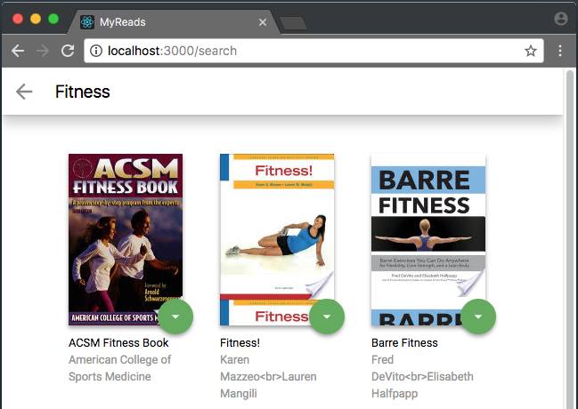

# MyReads: A Book Tracking App

MyReads is a web application that allows user to select and categorize books that they have read, are currently reading, or want to read.

## App Functionality

1. In this application, the main page displays a list of "shelves" (i.e. categories), each of which contains a number of books. The three shelves are:

* **Currently Reading**
* **Want to Read**
* **Read**

2. Each book has a control that lets you select the shelf for that book. When you select a different shelf, the book moves there. 

3. The main page also has a link to **/search**, a search page that allows you to find books to add to your library. The search page also has a link to **/ (the root URL)**, which leads back to the main page.
When you navigate back to the main page from the search page, you should instantly see all of the selections you made on the search page in your library.
Note: When a book is on a bookshelf, it should have the same state on both the main application page and the search page.

## Project dependencies

react-scripts from npm registry is used to build, test and run MyReads app.
Please refer dependencies and scripts section in package.json for more details.

* install all project dependencies with `npm install`
* start the development server with `npm start`
* MyReads frontend React App can be accessed via `http://localhost:3000/`

Additional information:
* project can be build with `npm run build`
* test scripts can be run using `npm run test`
## React application components overview

* [`App.js`](src/App.js) : the Main App component of the MyReads application
* [`ShowBookshelves.js`](src/ShowBookshelves.js) : the component lists the various bookshelves categories
* [`Bookshelf.js`](src/Bookshelf.js) : the component holds books that belongs to the specific bookshelf
* [`Book.js`](src/Book.js) : Book component renders book specific details such as book    
    cover thumbnail image, book title and book authors
* [`Search.js`](src/Search.js) : the component provides search related functionality for the books

The data flow is unidirectional so the parent component which owns the state shares the data to the child component using props and any state changes needed is accomplished by invocation of callback functions from child component.

## Backend Server

The MyRead App leverages the [`BooksAPI.js`](src/utils/BooksAPI.js) which serves as a backend server 
and provies the following methods to perform necessary operations on the backend:

* `getAll`
* `update`
* `search`

Note: Please refer the search keywords supported by backend server from [`SEARCH_TERMS.md`](SEARCH_TERMS.md)

## Create React App

This project was bootstrapped with [Create React App](https://github.com/facebookincubator/create-react-app).